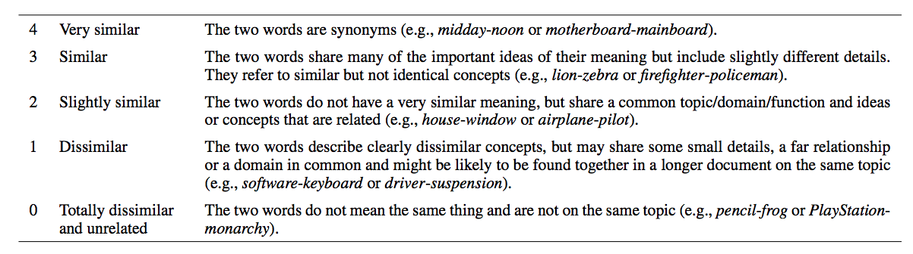

# Cross-lingual Semantic Word Similarity


## Problem definition
The goal of this task is to measure the semantic similarity of word pairs across languages. The task focuses on developing models that represent lexical items from different languages, which could be applied to determine the similarity of words cross-linguistically. An example could be to rank the similarity of translations, e.g. English come vs. German kommen. In this assignment, we will determine word similarity across English and Spanish.

The way the data was annotated to rate similarity between pairs is the following:



Given this, we could have:

| English | Spanish      | Score |
|---------|--------------|-------|
| cyclone | tifón 		 | 3.71  |
| actor   | televisión   | 1.58  |
| mojito  | mojito 		 | 4.00  |
| jacket  | agua mineral | 0.00  | 

## Scoring
How do we score whether our pairs of words are actually correlated? It doesn't make sense to use F-score because this isn't a classification task, so there's not really a concept of precision and accuracy if we're just trying to reproduce the scores that human annotators gave the pairs. 

Instead, we obtain the [Pearson](https://en.wikipedia.org/wiki/Pearson_correlation_coefficient) and [Spearman](https://en.wikipedia.org/wiki/Spearman%27s_rank_correlation_coefficient) correlation coefficients of the pair with the annotators and find their [harmonic mean](https://en.wikipedia.org/wiki/Harmonic_mean). In this case, our scores are between `0` and `1` and higher scores are better.

#### Pearson Correlation: 


#### Spearman Correlation: 


#### Harmonic Mean: 


The reasoning behind the metric can be found in Jurgens et al., 2014:
http://www.aclweb.org/anthology/S14-2003.
Mainly, 
> "Pearson correlation was chosen as the official evaluation metric since the 
> goal of the task is to produce similar scores. However, Spearman’s rank 
> correlation provides an important metric for assessing systems whose scores 
> do not match human scores but whose rankings might, e.g., string similarity 
> measures. Ultimately, a global ranking was produced by ordering systems by
> the sum of their Pearson correlation values for each of the four comparison
> levels."


## Baselines to Implement

### Simple Baseline - Randomized
The first simple baseline takes the average similarity score given to word pairs in the training data by the human annotators. It then randomly adds +/-1 to the computed average, and uses this as the prediction for a word pair. 

This baseline doesn't get you amazing results-- expect a score of about 23% on the development data.

### Published Baseline - Linear Regression
This baseline should train a linear transformation from an English word embeddings space to a Spanish word embedding space by using word alignments trained on the Europarl corpus (English-Spanish word pairs) and a pre-trained set of word vectors. It should then compute similarity ranks on various word pairs in the testing data by using the learned transformation from one language to the other and then uses simple cosine similarity for word embedding similarity rankings.

Expect a performance of about 34% on the development data.

## The How-To

### Prepare word alignments
To do this, first get the English-Spanish word pairs from the Europarl corpus. We have truncated the files for your since they're too big to run on biglab:

English:[`en_trunc.txt`](data/en_trunc.txt)

Spanish: [`es_trunc.txt`](data/es_trunc.txt)

Next you need to format the data such that it can be used with the `fast_align` library. For that, you can use our provided `helpers.py` file. Just run our [`helpers.py`](helpers.py) with no arguments. This will output `data/combined_trunc.txt`.

Finally, generate our actual alignments. Download and build `fast_align` as described here: https://github.com/clab/fast_align.

And then, from the main directory, run:
```
./fast_align/build/fast_align -i data/combined_trunc.txt -d -o -v > data/forward.align_trunc
```
Which outputs forward alignments in `data/forward.align_trunc`. To get the final parsed alignments, simply run our [file](TrainingData.py):
```
python TrainingData.py
```
Which outputs final word aligned pairs in `data/training_trunc.txt`.


### Gather data
With your aligned word pairs in hand, the only other thing you need is an embedding space to translate between. We chose to use pre-trained fasttext word embeddings for this since we were able to find vectors trained on both English and Spanish wikipedia, but you could substitute any word vectors and the algorithm should still work.

Since the embedding files were too large, they have not been included with the repository. Type the following commands to get the data in the right path. From there type,
```
wget https://s3-us-west-1.amazonaws.com/fasttext-vectors/wiki.es.vec
wget https://s3-us-west-1.amazonaws.com/fasttext-vectors/wiki.en.vec
```

These vectors take up a lot of memory, so you can also filter them to just the words required, also with [one of our scripts](filterVectors.py):
```
python filterVectors.py data/training_trunc.txt,data/dev/data/en-es.trial.data.txt,data/test/data/en-es.test.data.txt data/en-vec.pickle data/es-vec.pickle
```

## Implement
Complete the [skeleton code](linear_baseline_skeleton.py) so that you can run:
```
python linear_baseline_skeleton.py test data/training_trunc.txt predictions.txt --english data/en-vec.pickle --spanish data/es-vec.pickle
```
This will generate a predictions file (`predictions.txt`).
To get the score, use [`score.py`](score.py) in the following manner
```
python score.py <gold> <predictions>
```

Which, in this case, probably means running
```
python score.py data/test/keys/en-es.test.gold.txt predictions.txt
```
